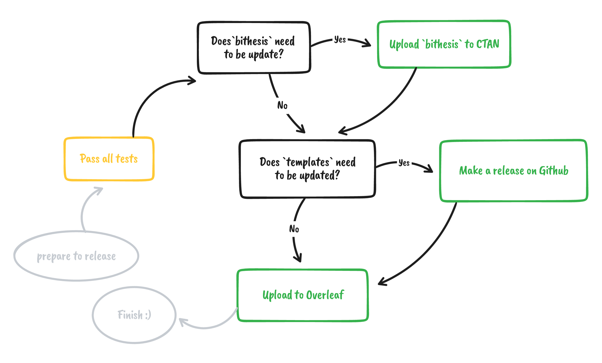

# 开发者指南

## 任务管理

本项目采用 [GitHub Projects](https://github.com/BITNP/BIThesis/projects) 进行任务管理。
你可以每次选择其中的一个小的 TODO 进行开发；来帮助项目一点一点前进。

## 开发命令

Makefile 主要针对 Linux 和 MacOS 开发者；如果你使用 Windows 开发，可以使用 Git Bash 或 Cygwin，不过偶尔可能需要手动执行 Makefile 中具体的命令。

当然，也欢迎你贡献更通用的开发脚本。

### 生成 `.cls` 文件

```Bash
make cls
```

### 生成宏包手册

```Bash
make doc
```

### 本地开发

一般开发需求分为三个部分：
- 修改 `bithesis.dtx` 文件。
- 修改 `templates/` 中某个模板。
- 修改其他文件。

#### bithesis.dtx 开发流程

1. 如果需求涉及到添加新的命令，可以先在 `templates/` 中进行具体的实现。
2. 然后，将实现的代码拷贝到 `bithesis.dtx`。
3. 然后运行 `make copy` 将新的 `*.cls` 更新到 `templates/` 下。
4. 不要忘记更新 `bithesis.dtx` 中的手册部分，添加相应说明。
5. 运行 `make doc` 编译手册。
6. 运行测试，确保你的改动不会影响到其他功能。

#### 修改 `templates/` 中模板的行为

如果改动仅仅涉及某个模板，那么相对简单一些：

1. 直接修改模板中的样式
2. 进行测试，确保你的改动能够正确编译；并且不会影响到其他效果。

#### 辅助命令

由于我们常常需要实时预览代码编译的效果，而 LaTeX 本身没有提供实时编译的功能。
因此我们常常需要来回运行 `make copy`、`latexmk` 以达成实时编译的效果。

因此 Makefile 里面提供了一些辅助开发的命令（以 `dev-`）开头。
可以帮助你自动化以上流程。

或者你可以使用类似 `rg --files | entr make copy` 以及 `rg --files | entr latexmk` 来达到
「代码修改后立即重新编译」的效果。

## 参考资料

- 本项目 LaTeX3，因此可以参考的手册包括 expl3 的文档。
- [fduthesis 项目代码](https://github.com/stone-zeng/fduthesis)有很多最佳实践，可以参考。
- 样式部分，应该参考研究生院和教务部的相关文件和通知。

## 单元测试和回归测试

运行 `make test` 将对所有的模板进行编译测试（同样被用于 GitHub Actions）。

运行 `make regression-test` 进行回归测试，该命令将比较目前已发布的最新版本和本地版本生成的 PDF 的差异。
使用前请确保已经安装下面这些依赖。

- [Zsh](https://github.com/ohmyzsh/ohmyzsh/wiki/Installing-ZSH)（POSIX）或 [PowerShell 7](https://learn.microsoft.com/zh-cn/powershell/scripting/install/installing-powershell-on-windows?view=powershell-7.3)（Windows）
- [diff-pdf](https://vslavik.github.io/diff-pdf/)
- [jq](https://jqlang.github.io/jq/)（仅用 Zsh 时需要）

运行 `make check-cls` 确保 `bithesis.dtx` 的修改都被同步到了 `templates/` 中。
（同样被用于 GitHub Actions）

## 打包

- `make overleaf` 可以生成上传 overleaf 所需要的 zip 文件。
- `make pkg` 可以生成上传 CTAN 所需要的 zip 文件。

## 上传 Overleaf 与更新

首先运行 `make overleaf` 打包文件。

1. 打开 Overleaf，点击左上角 `New Projects > Upload Projects` ，然后上传 zip 文件。
2. 点击 `Menu > Compiler` 选择 `XeLaTeX`，然后重新编译。
3. 修改项目名称，以便于区分。（我一般加上 `BIThesis-`）
4. 点击 `Share > Turn on link sharing`，复制 read 权限的链接。
5. 在 `BIThesis-wiki` 项目的首页 `README.md` 中，更新链接。

## Release 工作流

在一定量改进和新功能添加以后，需要开始着手发布新的版本。

版本号：参考 [Semantic Versioning 2.0.0 | Semantic Versioning](https://semver.org/) 。



